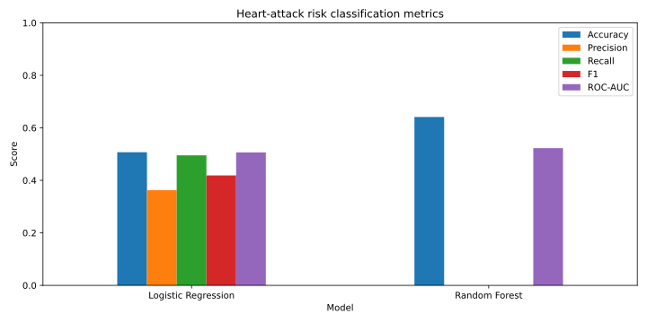
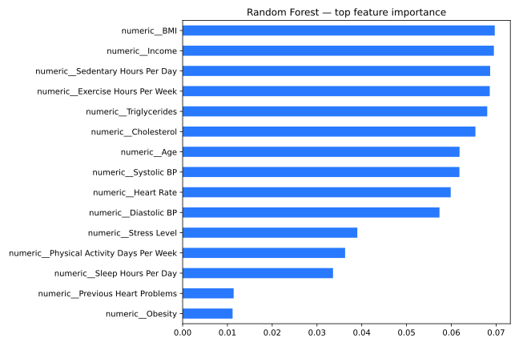

# Heart Attack Risk Classification

A cleaned machine-learning project for binary heart-attack risk classification. It corrects an early academic draft that treated the binary target as a regression problem.

## Approach

- Parse systolic and diastolic blood pressure from the combined source field.
- Remove the non-predictive patient identifier.
- One-hot encode categorical variables and scale numeric variables inside pipelines.
- Compare logistic regression and Random Forest on a stratified hold-out set.
- Report precision, recall, F1, ROC-AUC and confusion matrices rather than relying on accuracy alone.

## Visual outputs

| Model comparison | Random Forest feature importance |
|---|---|
|  |  |

## Result and interpretation

The hold-out evaluation found weak predictive signal: logistic regression achieved approximately 0.51 accuracy and 0.51 ROC-AUC, while the default Random Forest produced no positive-class recall. This negative result is retained deliberately. It demonstrates why correct task framing, class-specific metrics and honest evaluation matter more than presenting an impressive-looking model score.

## Run locally

```bash
python -m venv .venv
source .venv/bin/activate
pip install -r requirements.txt
python src/train.py --data data/heart_attack_prediction_dataset.csv --output artifacts
```

## Responsible use

This is a portfolio demonstration using a public synthetic dataset. It is not a medical device and must not be used for diagnosis or treatment decisions.

## Author

**Gokul Anand Srinivasan**  
[Portfolio](https://gokulanand2307.github.io/) | [GitHub](https://github.com/GokulAnand2307)
